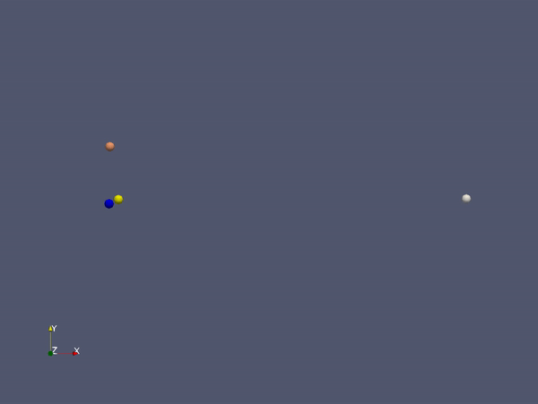
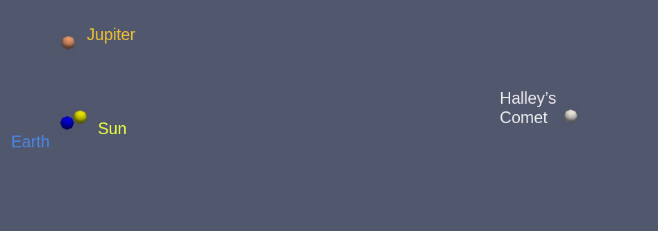

@mainpage PSE Molecular Dynamics

# Group C #
Members:
* Lukas Baader
* Severin Schmidmeier
* Tony Wang

# Code #
* Link:     https://github.com/wngTn/MolSim
* Branch:   main
* Revision: -

# Run Instructions #

In this project we have used the compiler `g++ 11.1.0`.

## Task - Run simulation ##
You can run the program with different flags and configuration, tailored to your convenience.

The general program call is:
  ```sh
  $ ./MolSim [-i <input_file>] [-e <end_time>] [-d <delta_t>] [-w <file-writer>] [-c <calculator>] [-r] [-h]
  ```


Where the `-w` flag specifies the file-writer.\
Current options are:
- `v` or `vtk` for the VTK-Writer (Default)
- `x` or `xyz` for the XYZ-Writer 

The `-c` flag specifies the calculation method used.\
Current options are:
- `sv` or `stoermerverlet` for the *Velocity-Stoermer-Verlet method*

The `-r` flag specifies that random input using `generate_input.py` should be generated.

The `-h` flag displays a help message

An example:
  ```sh
  $ ./MolSim -i ../eingabe-sonne.txt -e 420 -d 0.069 -w v 
  ```

This example uses the `eingabe-sonne.txt` file as input, sets 420 as `end_time` and 0.069 as `delta_t`. The output configuration has been set to `VTK-files`,
and the calculation method is the *Velocity-Stoermer-Verlet method*.

Another example:
  ```sh
  $ ./MolSim -r
  ```

This call generates a **random input file with 24 particles** (generated by `generate_input.py`). 
It uses the default parameters, that is:
- 1000 as `end_time` 
- 0.014 as `delta_t`
- The `VTK-Writer` as output
- The *Velocity-Stoermer-Verlet method* as calculation method

<br>

## Task - Doxygen ##

The default configuration is set to build the doxygen target. If you want to disable the target please use:

  ```sh
  $ cmake .. -D BUILD_DOC=OFF # disables the Doxygen target
  ```

To generate the documentation with Doxygen, use:

  ```sh
  $ make doc_doxygen
  ```

This will generate both the html as well as the latex output in the `build/doxys_documentation/` directory (assuming you named your build-folder "build"). To access the html documentation use the `build/doxys_documentation/index.html` file.


# Media #
## Task - Halleys Comet ##
Here you can see a simulation of the comets' orbit around our sun. We used `eingabe-sonne.txt` as our starting point and calculated the movement of the planets (and the comet).




## Task - Cool Photos ##
Assuming the center of the system is our sun, we can compare the mass with other celestial objects to identify them. We even got a photo of them!



# Misc #
The `generate_input.py` is the first step of automating our input-files. In future weeks this script can be extended to generate configurations for each environment or scenario respectively. These environments can range from planets over photons to water molecules.
Needless to say, to run this script, you need to have python installed on your machine.