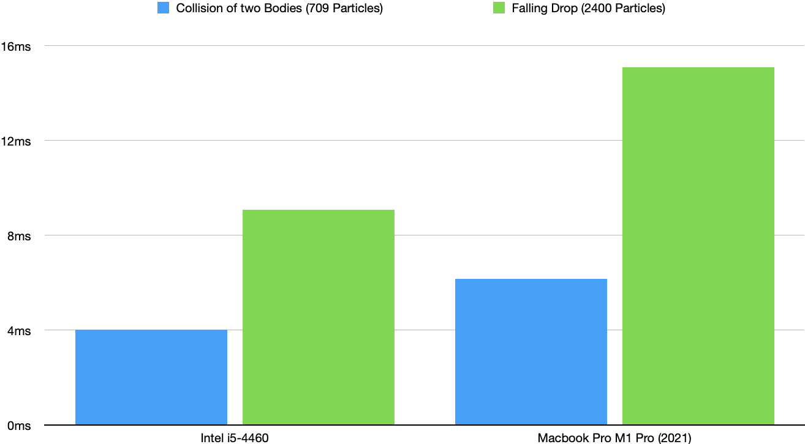
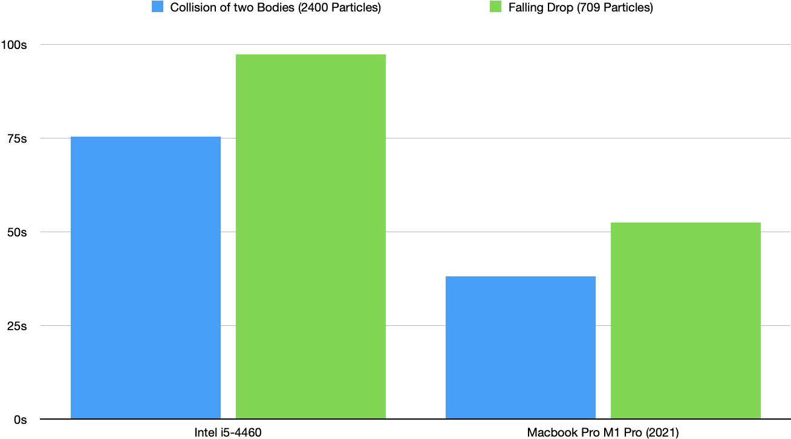

# Group C - Assignment 3 #
Members:
* Lukas Baader
* Severin Schmidmeier
* Tony Wang

# Code #
* Link:     https://github.com/wngTn/MolSim
* Branch:   main
* Revision: -

# Run Instructions #

In this assignment we have used the compiler `g++ 11.1.0`.

The run instructions and flags are the same as last week:

```shell
./MolSim [-x <XML_file>] [-i <input_file>] [-g <generator input>] [-e <end_time>] [-d <delta_t>] [-w <writer>] [-c <calculator>] [-b <brownian_motion_velocity_mean>] [-r] [-m <execution_mode>]
```

| Flag |            Possible Values             | Explanation                                                                                                                                            | Default           |
|------|:--------------------------------------:|--------------------------------------------------------------------------------------------------------------------------------------------------------|-------------------|
| `i`  |             `path/to/file`             | This is the relative or absolute path to your `input_file`.                                                                                            | *None*            |
| `x`  |             `path/to/file`             | This is the relative or absolute path to your `XML_file`.                                                                                              | *None*            |
| `g`  |             `path/to/file`             | Specify an input file used for the ParticleGenerator.                                                                                                  | *None*            |
| `e`  |               \<double>                | The end_time value                                                                                                                                     | 1000              |
| `d`  |               \<double>                | The delta_t value                                                                                                                                      | 0.14              |
| `w`  |             v, vtk, x, xyz             | Specifies the output writer, consequently also the output file format                                                                                  | v (vtk)           |
| `c`  | g, grav, gravitation, lj, lennardjones | Declares what forces between the particles should be calculated                                                                                        | lj (lennardjones) |
| `b`  |               \<double>                | The <tt>brownian motion velocity mean</tt>. **Will be discarded for the JSON file generated particles**                                                | *None*            |
| `r`  |                 *None*                 | Specifies whether random particles should be generated.                                                                                                | *None*            |
| `m`  |        normal, debug, benchmark        | Specifies which execution mode should be used. **Debug** to enable logging, **normal** to disable logging or **benchmark** to disable all output files | normal            |


For the attentive reader the new `x` flag might have been noticeable ;) we will explain you the need in "Task 1 - XML Parser".


# Warning # 

> ⚠️ **If you have slow internet**: We fetch three packages with *FetchContent*,
> thus the initial CMake-build may take some time (~1min).
>
> We decided against including the zip files into our directory, for we did not want
> to pollute the repository too much.

> ⚠️ **File structure**: Please put the `build` directory (the directory you
> execute `make`) directly in the root project path, else the automatically generated files
> will not work properly. Like such:
> ```
> MolSim
> .
> ├── CMakeLists.txt
> ├── Doxyfile
> ├── README.md
> ├── build/
> ├── cmake/
> ├── doc_pages/
> ├── input/
> ├── libs/
> ├── media/
> ├── src/
> └── test/
> ```

> ⚠️ **Doxygen**: This assignment we added the automatic generation of inheritance diagrams,
> thus you need to install the `graphviz` package to successfully generate the documentation

# Task 0 - Tests #

This assignment we pursued the advice and added `enable_testing()` into the
root `CMakeLists.txt`. Therefore, you can run `ctest` in the `build` directory
directly.

## Running the tests ##

1. Create the build directory and cd into it:
```shell
mkdir build && cd build 
``` 
2. Build everything, including the tests in the build directory by turning on the option:
```shell
cmake .. -DBUILD_TEST=ON
``` 

3. Compile everything, including the tests:
```shell
make # use "make -j6" for faster compilation
``` 

5. Simply run `ctest`in the build directory:
```shell
ctest
``` 

## Disabling the tests ##

If you do not want to compile the tests, you can turn off the build option
in the CMake by executing cmake without any arguments (Step 2):

```shell
cmake .. # Makefile won't build the tests anymore
```

# Task 1 - XML Parser #

We have implemented a new way to enter input data with [XML files](https://www.w3.org/XML/).  
To specify XML input use flag  ```-x <xml_file>``` like this:

```bash
./Molsim -x ../input/file/input_assignment_3.xml
```
The file structure allows inputs for both **Linked Cell and Direct Sums** calculation.  
This example file shows the **structure** you need to follow:
```xml
<?xml version="1.0" encoding="utf-8"?>
<simulation t_end="0.5" delta_t="0.00005" writeFrequency="100" outputWriter="vtk">
    <container type="linkedcell">
        <rCut>3.0</rCut>
        <domainSizeX>120</domainSizeX>
        <domainSizeY>100</domainSizeY>
        <domainSizeZ>1</domainSizeZ>
        <borderType>
            <left>outflow</left>
            <right>outflow</right>
            <upper>outflow</upper>
            <lower>outflow</lower>
            <front>outflow</front>
            <back>outflow</back>
        </borderType>
    </container>
    <calculator type="lennardjones">
        <epsilon>5</epsilon>
        <sigma>1</sigma>
        <brownianMotion>0.0</brownianMotion>
    </calculator>
    <outputFile>output</outputFile>
    <generatorInfo type="sphere">
        <x>30.0</x>
        <y>15.0</y>
        <z>0.0</z>
        <v1>20.0</v1>
        <v2>0.0</v2>
        <v3>0.0</v3>
        <mass>1.0</mass>
        <distance>1.1225</distance>
        <brownianFactor>0.1</brownianFactor>
        <dim>2</dim>
        <radius>12</radius>
    </generatorInfo>
</simulation>
```
For the direct-sum container-type and the gravitation calculator-type, no additional elements are needed inside the `container` or `calculator` element.
If the generator info is for a `cuboid` shape, the `radius` element has to be replaced with `n1`, `n2` and `n3` elements specifying the dimensions of the cuboid.
All attributes of the `simulation` element shown in the example are required. There is an additional optional boolean attribute `random` to enable randomly generated particles.
Some attributes and elements are enum types: For the `outputWriter` attribute only `vtk` and `xyz` are valid, for the calculator `type` attribute only `gravitation` and`lennardjones`, for the generatorInfo `type` attribute only `sphere` and `cuboid`, for the container `type` attribute only `directsum` and `linkedcell` and for the border types only `outflow`,`periodic` and `reflective`.

The parser is generated from a XSD file using `xsdcxx cxx-tree --std c++11 --generate-doxygen --generate-serialization --hxx-suffix .h --cxx-suffix .cpp simulation.xsd`

# Task 2 - Linked Cell Method #

> ⚠️ **Halo Cell and Boundary Cells**: We did not implement halo cells nor boundary cells, for we did not have the need to implement those


The new container type, the LinkedCellContainer and the corresponding calculator, LinkedCell realize the linked-cell algorithm.

### Container
The LinkedCellContainer manages a `std::vector<Particles>` containing all particles of the simulation and a `std::vector<Cell>` used for calculation. Each `Cell` contains a `std::vector<Particle*>` with pointers to some of the particles of the main vector in the container.


### Boundary Conditions
As aforementioned, no halo cells are used at the moment. Outflowing particles are set to invalid after their newly calculated position is determined to be outside of the domain and reflective boundaries are realized without generating a 'real' particle outside of the domain. Therefore, since invalid particles are not distributed among the cells and not used for calculations no halo cells are needed.

# Task 3 - Boundary Conditions #

We have implemented three boundary conditions, that is:
- **Reflective**
  A reflective boundary is realized using conceptual "ghost particles" located on the boundary. No real Particle object is created.
- **Overflow**
  Particles leaving the boundary are set to invalid, which leads to them not being distributed among the Cells and therefore not being part of the calculation anymore. Before writing invalid particles are removed using the erase-remove idiom.
- **Cyclic**
  Particles leaving the boundary are emplaced on the opposite end of the domain. This is still very much *WIP*, since forces don't act periodic. This leads to segfaults for some inputs if a particle is 'teleported' into another Particle on the oppsite side.

# Task 4 - Simulation of a falling drop - Wall #

To see our beautiful simulation, please refer to this link: [nextcloud](https://nextcloud.in.tum.de/index.php/s/Ec5r4EtDCbBemL8)

As we provide you with the best quality, this video has a size of around 280 MB :)


Our input file is, and can also be found in the `input/files/` directory:
```xml
<?xml version="1.0" encoding="utf-8"?>
<simulation t_end="10" delta_t="0.00005" writeFrequency="50" outputWriter="vtk">
    <container type="linkedcell">
        <rCut>3.0</rCut>
        <domainSizeX>120</domainSizeX>
        <domainSizeY>50</domainSizeY>
        <domainSizeZ>1</domainSizeZ>
        <borderType>
            <left>reflective</left>
            <right>reflective</right>
            <upper>reflective</upper>
            <lower>reflective</lower>
            <front>outflow</front>
            <back>outflow</back>
        </borderType>
    </container>
    <calculator type="lennardjones">
        <epsilon>5</epsilon>
        <sigma>1</sigma>
        <brownianMotion>0.0</brownianMotion>
    </calculator>
    <outputFile>output</outputFile>
    <generatorInfo type="sphere">
        <x>60.0</x>
        <y>25.0</y>
        <z>0.0</z>
        <v1>0.0</v1>
        <v2>-10.0</v2>
        <v3>0.0</v3>
        <mass>1.0</mass>
        <distance>1.1225</distance>
        <brownianFactor>0.1</brownianFactor>
        <dim>2</dim>
        <radius>15</radius>
    </generatorInfo>
</simulation>
```


# Results #

All simulations can be found here: https://nextcloud.in.tum.de/index.php/s/sZymw4MmLHwHByq
(The arrows denote the direction of the velocity)

# Benchmarking #

## Set up time ##



## Run Time ##



# Miscellaneous #

## Space filling curves ##

We had some efforts trying to perform the mapping from cells in the 3D grid to a 1D vector of cells using a space filling curve like the [Peano-Curve](https://en.wikipedia.org/wiki/Peano_curve). This would lead to neighboring cells being closer in the vector of cells and therefore would (maybe) lead to better cache performance. Eventually we decided to not use this approach because it would make a lot of things more complicated without guaranteed performance gains.

## Doxygen ##

In this assignment we made our doxygen documentation design
more beautiful by adding an HTML stylesheet, since the original was gnarly ugly. We used the css templates from this repository: https://github.com/jothepro/doxygen-awesome-css.

We used and tested the documentation with:
- `Doxygen 1.9.2`

And as browser we have used:
- Safari 15.1
- Chrome 96.0.4664.55.