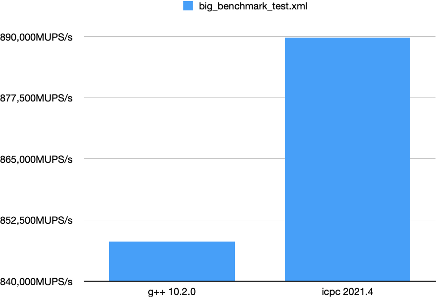
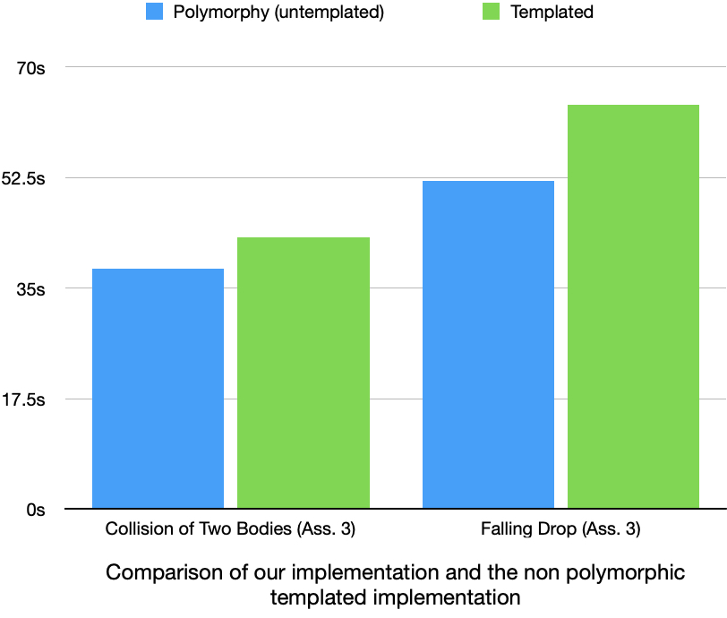
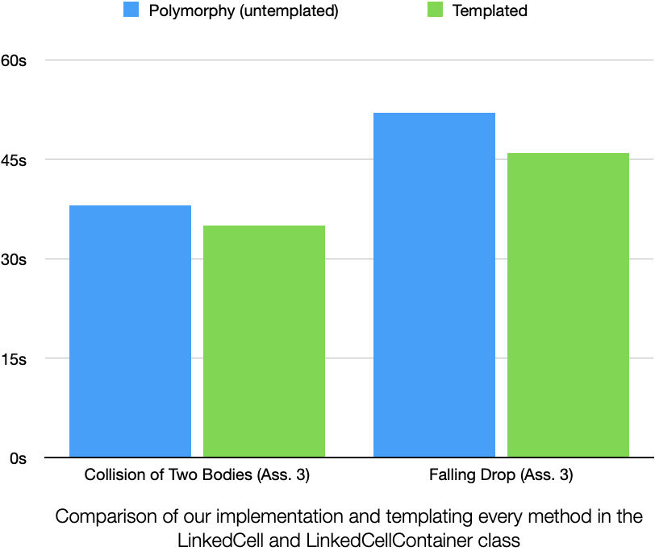
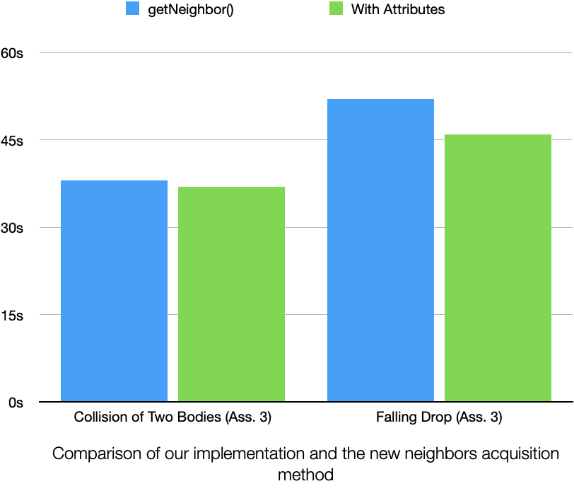
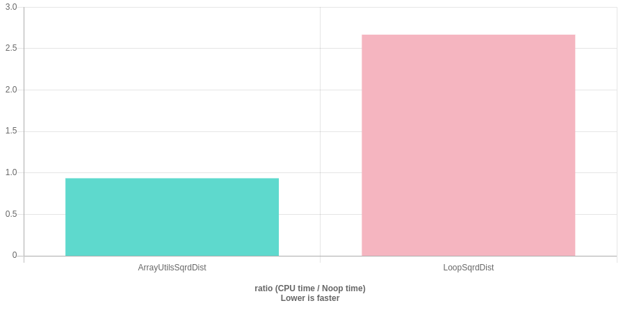
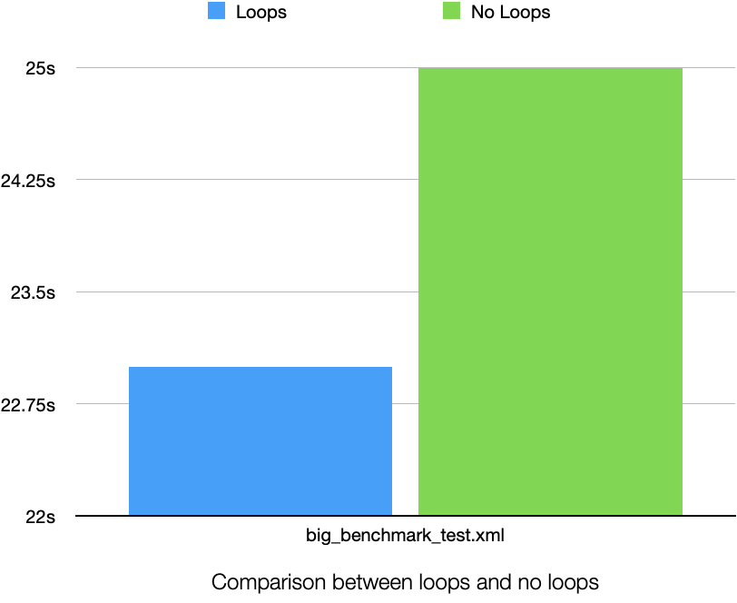
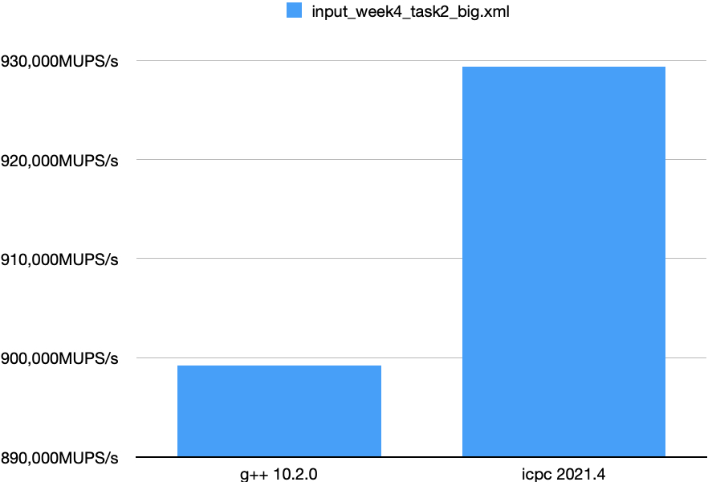

# Group C - Assignment 4 #
Members:
* Lukas Baader
* Severin Schmidmeier
* Tony Wang

# Code #
* Link:     https://github.com/wngTn/MolSim
* Branch:   main
* Revision: -

# Run Instructions #

In this assignment we have used the compiler `g++ 11.1.0`.

The run instructions and flags did not change since last assigment.

```shell
./MolSim [-x <XML_file>] [-i <input_file>] [-g <generator input>] [-e <end_time>] [-d <delta_t>] [-w <writer>] [-c <calculator>] [-b <brownian_motion_velocity_mean>] [-r] [-m <execution_mode>]
```

| Flag |            Possible Values             | Explanation                                                                                                                                            | Default           |
|------|:--------------------------------------:|--------------------------------------------------------------------------------------------------------------------------------------------------------|-------------------|
| `i`  |             `path/to/file`             | This is the relative or absolute path to your `input_file`.                                                                                            | *None*            |
| `x`  |             `path/to/file`             | This is the relative or absolute path to your `XML_file`.                                                                                              | *None*            |
| `g`  |             `path/to/file`             | Specify an input file used for the ParticleGenerator.                                                                                                  | *None*            |
| `e`  |               \<double>                | The end_time value                                                                                                                                     | 1000              |
| `d`  |               \<double>                | The delta_t value                                                                                                                                      | 0.14              |
| `w`  |             v, vtk, x, xyz             | Specifies the output writer, consequently also the output file format                                                                                  | v (vtk)           |
| `c`  | g, grav, gravitation, lj, lennardjones | Declares what forces between the particles should be calculated                                                                                        | lj (lennardjones) |
| `b`  |               \<double>                | The <tt>brownian motion velocity mean</tt>. **Will be discarded for the JSON file generated particles**                                                | *None*            |
| `r`  |                 *None*                 | Specifies whether random particles should be generated.                                                                                                | *None*            |
| `m`  |        normal, debug, benchmark        | Specifies which execution mode should be used. **Debug** to enable logging, **normal** to disable logging or **benchmark** to disable all output files | normal            |


# Warning # 

> ⚠️ **Same warnings as last assignment**: We ommited the warnings in this assignment, so it does seem like everything is alrighty :)

> ⚠️ **Compiler Warning**: If you use g++11.2.0 you might get a compiler warning in the json parser library at `nlohmann/json.hpp:20708:10`.

# Task 0 - Tests #

Tests are run as usual.

## Running the tests ##

1. Create the build directory and cd into it:
```shell
mkdir build && cd build 
``` 
2. Build everything, including the tests in the build directory by turning on the option:
```shell
cmake .. -DBUILD_TEST=ON
``` 

3. Compile everything, including the tests:
```shell
make # use "make -j6" for faster compilation
``` 

5. Simply run `ctest`in the build directory:
```shell
ctest
``` 

## Disabling the tests ##

If you do not want to compile the tests, you can turn off the build option
in the CMake by executing cmake without any arguments (Step 2):

```shell
cmake .. # Makefile won't build the tests anymore
```

# Task 1 - Thermostats #

We implemented a thermostat using the given formulas. The `Thermostat::applyTemperature` function is called in the main simulation loop every `nThermostat` iterations.
For the calculation of the kinetic energy, we added a `dotProduct` method in the `ArrayUtils` class.
Accordingly we updated the XML format and added the following elements (`Ttarget` and `deltaTemp` are optional):
```xml
    <thermostat>
  <nThermostat>1000</nThermostat>
  <Tinit>40.0</Tinit>
  <Ttarget>25.5</Ttarget>
  <deltaTemp>2.0</deltaTemp>
</thermostat>
```

# Task 2 - Simulation of the Rayleigh-Taylor instability #

## ~~Cyclic~~ Periodic Boundaries ##

Periodic boundaries can be specified in the XML-file as:

```xml
<borderType>
  <left>periodic</left>
  <right>periodic</right>
  <upper>periodic</upper>
  <lower>periodic</lower>
  <front>periodic</front>
  <back>periodic</back>
</borderType>
```

It is advised that on the other side of a periodic border there has to be another periodic border.

If the other side is a *reflective* border and a particle crosses the border, it immediately goes AWOL, since it gets a massive force push from the ghost particle.

If the other side is an *outflow* border, a particle on the *outflow* border can get too close to the particle at the *periodic* border, making the particle at the *periodic* border go AWOL.


## Gravitational force ##

Gravity is applied in the `setUp()` method in the `LinkedCellContainer` class. Instead of initializing the force of every particle with `std::array<double, 3>{0., 0. 0.}`, we instead initialize them with `std::array<double, 3>{0., particle.getM() * g, 0.}`, where `g` is the gravitational factor *g_grav*.


## Combined Sigma and Epsilon values ##

Our simulation now supports different σ and ε values for each generated shape.
The XML input for shapes now has two additional fields: `<sigma>` and `<epsilon>`.
To not calculate the shared σ and especially ε values for every particle pair for every force calculation, we calculate them once for each pair of particle types in the beginning and store them in lookup tables.
To keep the `type` attribute usable for other things, we introduced another attribute of the `Particle` class for indexing the lookup table: `se_index`.


# Task 3 - Simulation of a falling drop - Liquid #

## Checkpointing ##

Checkpointing is realized with two new fields in the input XML:
`<checkpointOutput>file.json</checkpointOutput>` and `<checkpointInput>file.json</checkpointInput>`
When using the first one, the current state at the end of the simulation is written to the `file.json` json file. When using the second one, a previously written state is read as input.

The checkpoint also saves the current iteration number, therefore when using the same output file name, one gets a concurrent sequence of sequentially numbered output files.

In the checkpoint file the current mapping from particle types to sigma/epsilon values. When restarting the simulation new particles then get according types and the sigma and epsilon tables are built accordingly.

For converting to JSON some Classes (e.g. `Particle`) got custom converter functions `to_json` and `from_json`. Using these and the nlohmann/json library reduces the main JSON-write function to only 5 simple lines of code:
```cpp
json j;
j["iterations"] = iteration;
j["particles"] = container;
j["calc"] = lc_calculator;
std::ofstream {filename} << j << std::endl;
```

Reading the JSON file is equally simple (see file `CheckpointReader.cpp` for details).

# Task 4 - Performance Measurement on the Cluster #

> ⚠️ **Codebase**: The following benchmarks and profiling have been done with the final code base of assignment 4.

> ⚠️ **Compiler**: We have used the g++ 10.2.0 compiler and icpc 2021.4 on the cluster, since it is the most recent one.

The performance measurements on the cluster have been done with the `input/files/assignment_4/big_benchmark_test.xml` file.

Quick overview:
- 14400 particles
- Zero gravity
- No thermostat applied
- Two dimensions
- Four periodic boundaries

We used the <tt>lxlogin1.lrz.de</tt> login node (Haswell CoolMUC-2).

We have used following modules:
```shell=
$ module list
Currently Loaded Modulefiles:
 1) admin/1.0     3) lrz/1.0        5) xerces-c/3.2.1   7) intel-oneapi-compilers/2021.4.0   9) intel-oneapi-mpi/2021-intel  11) intel-oneapi/2021.4  
 2) tempdir/1.0   4) cmake/3.16.5   6) gcc/10.2.0       8) intel-oneapi-mkl/2021            10) intel-oneapi-itac/2021.4.0 
```

## Vtune Amplifier ##

We have used this .cmd file for submitting the batch:

```shell=
#!/bin/bash

#SBATCH -J Vtune_Job
#SBATCH -o ./%x.%j.%N.out
#SBATCH -D ./
#SBATCH --get-user-env
#SBATCH --clusters=serial
#SBATCH --partition=serial_std
#SBATCH --cpus-per-task=1
#SBATCH --mem=32gb
#SBATCH --mail-user=tony.wang@tum.de
#SBATCH --export=NONE
#SBATCH --time=24:00:00
module unload intel-mpi intel-mkl intel
module load xerces-c intel-parallel-studio
 
amplxe-cl -collect hotspots ./MolSim/build/MolSim -x MolSim/input/files/assignment_4/big_benchmark_test.xml -m benchmark
```

Resulting in following profile:

```
Elapsed calculation time [milliseconds]: 53709
MUPS/s: 804603

Top Hotspots
Function                                 Module  CPU Time
---------------------------------------  ------  --------
calculator::LinkedCell::calcNeighbors    MolSim   28.422s
calculator::LinkedCell::calcFWithinCell  MolSim    6.596s
Particle::setF                           MolSim    5.788s
calculator::LinkedCell::calcF            MolSim    1.728s
Particle::getX                           MolSim    1.628s
[Others]                                 N/A       9.549s
Effective Physical Core Utilization: 3.5% (0.983 out of 28)
```

Confirming what we have strongly suspected to be true - the force calculation takes a lot of computing time.


## Gprof ##

We have used:
```shell=
$ cmake -DCMAKE_CXX_FLAGS=-pg -DCMAKE_EXE_LINKER_FLAGS=-pg -DCMAKE_SHARED_LINKER_FLAGS=-pg ..
```

to create an executable with the profiling flags for gprof.

We ran this executable with:

```
#!/bin/bash

#SBATCH -J Default
#SBATCH -o ./%x.%j.%N.out
#SBATCH -D ./
#SBATCH --get-user-env
#SBATCH --clusters=serial
#SBATCH --partition=serial_std
#SBATCH --cpus-per-task=1
#SBATCH --mem=32gb
#SBATCH --mail-user=tony.wang@tum.de
#SBATCH --export=NONE
#SBATCH --time=24:00:00
module load xerces-c
 
./MolSim/build/MolSim -x MolSim/input/files/assignment_4/big_benchmark_test.xml -m benchmark
```

This created a `gmon.out` file, which we analyized with:
```shell=
$ gprof MolSim/build/MolSim gmon.out > analysis.txt
```


Resulting in the following profile (snippet):

```
Flat profile:

Each sample counts as 0.01 seconds.
  %   cumulative   self              self     total           
 time   seconds   seconds    calls   s/call   s/call  name    
 41.40     18.57    18.57 172915200     0.00     0.00  calculator::LinkedCell::calcNeighbors(LinkedCellContainer&, std::array<int, 3ul> const&, Particle*)
  9.67     22.91     4.34 8334359592     0.00     0.00  Particle::getX() const
  8.49     26.72     3.81                             Particle::Particle(Particle&&)
  8.48     30.53     3.81 13076712     0.00     0.00  calculator::LinkedCell::calcFWithinCell(Cell&)
  5.55     33.02     2.49 1706211408     0.00     0.00  Particle::getSEIndex() const
  4.44     35.01     1.99 212925856     0.00     0.00  Cell::begin()
  3.37     36.52     1.51        2     0.76    17.40  calculator::LinkedCell::calcF(ParticleContainer&)
  2.34     37.57     1.05                             calculator::LinkedCell::moveParticles(LinkedCellContainer&)
  1.89     38.42     0.85 896334504     0.00     0.00  Particle::setF(std::array<double, 3ul>)
  1.76     39.21     0.79 1242064104     0.00     0.00  Particle::getF() const
  1.74     39.99     0.78                             Particle::getType() const
  1.56     40.69     0.70                             LinkedCellContainer::setup()
  1.56     41.39     0.70                             calculator::LinkedCell::calcX(ParticleContainer&) const
  1.03     41.85     0.46                             PhysicsCalc::calcV(ParticleContainer&) const
  ...
```

Apart from the obvious, we can behold  that `getX()` takes almost 10% of our computing time, which is kind of curious to us, since this also emerged with other profilers like `Dtrace` (see Task 5.2).

Other measurements are still not too intelligible, for instance that the <tt>move constructor</tt> of `Particle` takes almost 9% of our computing time, same as `calcFWithinCell()`, which should have much more computing time. In addition, our <tt>move constructor</tt> does not even get called once (looking at our logs).

## G++ vs ICPC ##

We compared the <tt>g++ 10.2.0</tt> compiler with the <tt>icpc 2021.4</tt> compiler on the linux cluster.

For both measurements we used this batch file:

```
#!/bin/bash

#SBATCH -J Default
#SBATCH -o ./%x.%j.%N.out
#SBATCH -D ./
#SBATCH --get-user-env
#SBATCH --cpus-per-task=1
#SBATCH --mem=32gb
#SBATCH --mail-user=tony.wang@tum.de
#SBATCH --export=NONE
module load xerces-c
 
./MolSim/build/MolSim -x MolSim/input/files/assignment_4/big_benchmark_test.xml -m benchmark
```


CMake with g++:
```shell=
cmake -DCMAKE_BUILD_TYPE=Release -DCMAKE_CXX_COMPILER=/dss/dsshome1/lrz/sys/spack/release/21.1.1/opt/x86_64/gcc/10.2.0-gcc-ll77x2s/bin/g++ -DCMAKE_C_COMPILER=//dss/dsshome1/lrz/sys/spack/release/21.1.1/opt/x86_64/gcc/10.2.0-gcc-ll77x2s/bin/gcc ..
```

CMake with icpc:
```shell=
cmake -DCMAKE_BUILD_TYPE=Release -DCMAKE_CXX_COMPILER=/dss/dsshome1/lrz/sys/spack/.oneapi/opt/x86_64/intel-oneapi-compilers/2021.4.0-gcc-42kpqil/compiler/2021.4.0/linux/bin/intel64/icpc -DCMAKE_C_COMPILER=/dss/dsshome1/lrz/sys/spack/.oneapi/opt/x86_64/intel-oneapi-compilers/2021.4.0-gcc-42kpqil/compiler/2021.4.0/linux/bin/intel64/icc -DCMAKE_CXX_FLAGS="-O3 -ip -ipo -fast" ..
```

### Results ###



Intel takes the lead in this round!


# Task 5.1 - Tuning the sequential Performance Part 1 #

> ⚠️ **Codebase**: The following benchmarks and profiling have been done with the code base of assignment 3 and input files from assignment 3.


## Profiling (DTrace) ##

For tweaking and changing bits of the code, we used the **CLION 2021.3** internal profiler. The underlying profiler used on MacOS is <tt>DTrace 1.19</tt>. This enabled us to quickly identify bottlenecks by simply staying in our IDE.

We have tried and used <tt>gprof</tt> and <tt>Vtune Amplifier</tt> (see Task 4); however, we felt more comfortable with the CLION internal profiler.

In this example we have used the **Falling Drop** input file from assignment 3.

Results are:

- `calculator::LinkedCell::calcF` using ~83% of total sample time
  - `calculator::LinkedCell::calcNeighbors` using ~75% of the sample time of its father `calcF`
    - `calculator::LinkedCell::ljforce` using ~55% of the sample time of its father `calcNeighbors`

  - `calculator::LinkedCell::calcFWithinCell` using ~18 % of the sample time of its father `calcF`
  - `calculator::LinkedCell::reflectiveBoundary` using ~7% of the sample time of its  father `calcF`
  - `LinkedCellContainer::getNeighbors` using ~7% of the sample time of its father `calcF`

## Profiling (Perf) ##

Profiling with the built in linux `Perf` profiler using the CLion IDE gave results that are very similar to the `DTrace` values above.

## Avoid Polymorphism with templates (Failure) ##

Polymophism is sometimes derided at because of the underlying implementation with *vtables*, it tends to have a bad run time performance. Thus, we have tried to avoid polymorphism and use templates instead. We have refactored the `calcX`, `calcV` and `calcF` methods. Thus, instead of having specific methods depending on the class instantiation, we have specific methods depending on the parameter type.

Following, we provide some insights of our changes.

### Previous State ###

Our **previous decleration** of the `calcX` method:
- ```cpp=
    virtual void calcX(ParticleContainer &particles) const;
    ```
  This method will be overwritten in the `LinkedCell` class, since it needs a different functionality.

Our **previous decleration** of the `calcF` method:
- ```cpp=
    virtual void calcF(ParticleContainer &particles) = 0;
    ```
  This method will be overwritten in every class that inherits this method, and thus also in the `LinkedCell` class.

So instead of using different classes, we simply used templates to let the compiler give us two different implementations for the same function.

### Altered State ###

Our **altered decleration** of the `calcX` method:
- ```cpp=
    // Unspecialized method
    template<typename T>
    void Calculator::calcX(T & particles);
    
    /// Specialized method (for LinkedCell calculation)
    template<>
    void Calculator::calcX<LinkedCellContainer>(LinkedCellcontainer & particles);
    ```
  The unspecialized method gets a `DirectSumParticleContainer` as type parameter, and does the "normal" position calculation, whereas the specialized method gets a `LinkedCellContainer` as type parameter, and does the "LinkedCell" position calculation.

Analogously, the templated `calcF` method looked like this:
- ```cpp=
    // Unspecialized method
    template<typename T>
    void Calculator::calcF(T & particles);
    
    /// Specialized method (for LinkedCell calculation)
    template<>
    void Calculator::calcF<LinkedCellContainer>(LinkedCellcontainer & particles);
    ```

*The `calcV` decleration is analogous to the other methods, and thus not highlighted*

### Results ###

Alas, the results were sobering, as it did not reduce the run time - in contrary, it increased the runtime a few seconds. The compile time was not documented, but naturally it increased, too, albeit it was not drastically.

**Blue is our previous implementation, green the new implementation**

*Tested on the MacBook Pro M1 Pro*

## Using templates and constexpr recklessly (Success?) ##

Templates and the `constexpr` keyword have been praised in C++ to be a game changer for performance, so we have thought: *"simply implement it everywhere!"* - maybe it will help us improve our performance, and so we did.

Following, we have refactored **every** *non-virtual* method in the `LinkedCellContainer` and `LinkedCell` class to a templated constexpr method - **even methods that are always called with the same parameter types and only evaluable at run time.**

So for instance, we have refactored this method:
- ```cpp=
    void calcNeighbors(LinkedCellContainer &grid, const std::array<int, 3> & neighbors, Particle* p);
    ```
To this method:
- ```cpp=
    template<typename G, typename N, typename P>
    void calcNeighbors(G &grid, const N & neighbors, P* p);
    ```

### Results ###

We did not approach this solution with any hope of a better performance - we were glad our code looked quite professional now. However, irony struck us, as we benchmarked our refactored code: the run time seconds started to crumble!

We also did not document the compile time; albeit, with header files that have gotten twice or thrice as big, the compile time surely gained a few seconds. However, we have compiled the refactored code on a **MacBook M1 Pro** with `make -j` and thus, we did not notice a huge change in compile time performance as this laptop is blazingly fast (before refactoring: 12s with compiling the tests).


**Blue is our previous implementation, green the new implementation**

*Tested on the MacBook Pro M1 Pro*

Eureka! We made the code faster! **But how? We did not even make use of why templates have been introduced - that is using the same method with different parameter types, neither constexpr.**

We concluded that it must have been be pure luck, changing the order of the code might have helped the compiler to identify more ways to improve the code. It simply did not make sense how merely templating every method (that are only called with the same parameter typ!) helped the runtime. However, in the end templates did make the run time seconds to crumble! Even though, we do not know why.

After heavy disputes, we did abolish this change in the end in fear of questions like:
- A: *"Why did you template every method, even though you call them with the same parameter type everytime?"*
- B: *"It made the code faster"*
- A: *"And why is that?"*
- B: *"Hmm... must've been magic"*

## Saving the neighbors (Success) ##

We were astonished about the 7% the `getNeighbors` method uses as sample time in the `calcF` method. It should merely return the neighbor indices, which are always the same in every iteration - it should not even calculate anything!

Therefore we have added three member-attributes to the `Cell` class:
- ```cpp=
    struct Cell {
        /* Implementation */
        private:
            /**
         * The index of the cell
         */
        std::array<int, 3> index{};

        /**
         * The 2D neighbors of this cell
         */
        std::vector<std::array<int, 3>> neighbors2D{};

        /**
         * The 3D neighbors of this cell
         */
        std::vector<std::array<int, 3>> neighbors3D{};
    }
    ```

This way we only have to calculate the neighbors once, that is when the LinkedCellContainer is created.

**We were successful in reaping the fruits of our optimization!** The sample time of the `getNeighbors` method went naturally to 0%, the run time, however, also decreased:

**Blue is our previous implementation, green the new implementation**

*Tested on the MacBook Pro M1 Pro*


## You learn from your mistakes ##

The aforementioned *template changes* have been implemented in different commits on the `tony_new` branch. However, after we decided to not use these changes, we resetted the branch to a previous commit without these changes - not knowing that it will erase all the commits after that. Well...we did wear sackcloth and ashes on that day.

Now we know that these kind of performance refactoring should be done on new branches, instead of commits. This way nothing will be overwritten, and nothing can get lost.


# Task 5.2 - Tuning the sequential Performance Part 2 #
> ⚠️ **Codebase**: The following benchmarks and profiling have been done with the final code base of assignment 4.

## Profiling (DTrace) ##

Again we have used the **CLION 2021.3** internal profiler with <tt>DTrace 1.19</tt>.

In this example we have used our own benchmark input file, which can be found in `input/files/assignment_4/big_benchmark_test.xml`.

It has:
- 14400 particles
- Zero gravity
- No thermostat applied
- Two dimensions
- Four periodic boundaries.

Results are:

- `calculator::LinkedCell::calcF` using ~84% of total sample time
  - `calculator::LinkedCell::calcNeighbors` using **~63%** of the sample time of its father `calcF`
  - `calculator::LinkedCell::calcFWithinCell` using **~14%** of the sample time of its father `calcF`
  - `Particle::getX` using **~11%** of the sample time of its father `calcF`


## Squared Distance Calculation (Failure) ##

The 11% sample time the `getX()` needed befuddled us tremendously. How can such a simple method make up almost 1/10 of our whole run time?

We digged through our code and stumbled upon following lines:

- ```cpp=
    double sqrd_dist = 0;
    for (int i = 0; i < DIM; i++) {
        sqrd_dist += LinkedCell::sqr(p_other->getX()[i] - p->getX()[i]);
    }
    ```

We have to execute these lines every time we are comparing two particles, following in plenty of calls.

Therefore, we seeked for ways to minimize these `getX()` calls, resulting in following code:

- ```cpp=
    auto temp = p_other->getX() - p->getX();
    temp = temp * temp;
    sqrd_dist = temp[0] + temp[1] + temp[2];
    ```

This change might not seem too dire, however, looking at *Quickbench*, these changes do have a noticeable impact:




Almost thrice as fast!

Naturally, we abolished the loops and exchanged these three lines of code immediately.

### Results ###

Profiling with <tt>Dtrace</tt>, we had following results:
- `calculator::LinkedCell::calcF` using ~86% of total sample time
  - `calculator::LinkedCell::calcNeighbors` using **~73%** of the sample time of its father `calcF`
  - `calculator::LinkedCell::calcFWithinCell` using **~12%** of the sample time of its father `calcF`
  - `Particle::getX` using **~4%** of the sample time of its father `calcF`


However, when we saw the runtime results, we were literally crying. These were tested with the `input/files/assignment_4/big_benchmark_test.xml` file on the MacBook Pro M1 Pro.

**Blue is our previous implementation, green the new implementation**



After hours of contemplating we came to the conclusion that it must have something to do with memory alignment, references that are returned from `getX()` and some compiler magic. Nevertheless, we were kind of devastated.


## Contest 1 (Sequential) ##

Using our input file for task 2 with the end time set to 0.5 (to only get 1000 iterations) we had the following results on the Linux-Cluster:

The compiler we used:
- compilation with g++ 10.2.0

```shell=
$ cmake -DCMAKE_BUILD_TYPE=Release -DCMAKE_CXX_COMPILER=/dss/dsshome1/lrz/sys/spack/release/21.1.1/opt/x86_64/gcc/10.2.0-gcc-ll77x2s/bin/g++ -DCMAKE_C_COMPILER=//dss/dsshome1/lrz/sys/spack/release/21.1.1/opt/x86_64/gcc/10.2.0-gcc-ll77x2s/bin/gcc ..
```
- compilation with icpc 2021.4

```shell=
$ cmake -DCMAKE_BUILD_TYPE=Release -DCMAKE_CXX_COMPILER=/dss/dsshome1/lrz/sys/spack/.oneapi/opt/x86_64/intel-oneapi-compilers/2021.4.0-gcc-42kpqil/compiler/2021.4.0/linux/bin/intel64/icpc -DCMAKE_C_COMPILER=/dss/dsshome1/lrz/sys/spack/.oneapi/opt/x86_64/intel-oneapi-compilers/2021.4.0-gcc-42kpqil/compiler/2021.4.0/linux/bin/intel64/icc -DCMAKE_CXX_FLAGS="-O3 -ip -ipo -fast" ..
```

The batch file used:

```
#!/bin/bash

#SBATCH -J Default
#SBATCH -o ./%x.%j.%N.out
#SBATCH -D ./
#SBATCH --get-user-env
#SBATCH --clusters=serial
#SBATCH --partition=serial_std
#SBATCH --cpus-per-task=1
#SBATCH --mem=32gb
#SBATCH --mail-user=tony.wang@tum.de
#SBATCH --export=NONE
module load xerces-c
 
./MolSim/build/MolSim -x MolSim/input/files/assignment_4/input_week4_task2_big.xml -m benchmark
```

### Result ###



Table 4: Comparison of different compilers on input file of task 2

| Input File                  | Compiler             | MUPS/s |
|-----------------------------|----------------------|--------|
| `input_week4_task2_big.xml` | <tt>g++ 10.2.0</tt>  | 899200 |
| `input_week4_task2_big.xml` | <tt>icpc 2021.4</tt> | 929368 |


# Miscellaneous #

### Water only liquid when frozen? ###

We noticed one additional thing due to a bug in the code:
In the thermostat we forgot to set the new scaled velocities and therefore didn't have any cooling for task 3.

Without cooling the liquid in the resulting simulation didn't behave like water at all, while in the correct simulation the liquid is defintely identifiable as such.

We don't know why the particles need to be cooled so much (the β for scaling the velocities is smaller than 0.1 for most iterations in task 3) for them to behave like one would expect, but we thought it's an interesting observation.

Maybe it's just not possible to simulate water with the basic calculation methods we use without cooling it or maybe the excersise was specifically designed to have this behaviour, so the instructor directly notices when the cooling isn't correct.

[Here](https://nextcloud.in.tum.de/index.php/s/i9dLLoLQzTCatj8) videos of both simulations can be seen.

### Cache misses ###

We also tried to measure cache misses using the command `perf stat -e task-clock,cycles,instructions,cache-references,cache-misses`, but that didn't really give us any valuable information.
The % of cache misses depends a lot on how filled the cell grid is, e.g. for a 10x10 square in the middle of a big domain we had 2-10% cache misses for a 200x200 domain and 35 - 55% misses for a 100x100 domain. This of course is due to the fact, that there are more cache references because there are way more cells. The absolute number of cache misses stayed the same for both domains.

The first 100 iterations of the big simulation from task 2 had around 10% cache misses, but we don't really know whether this is good or bad and didn't really manage to consistently change this number. It's highly fluctuating as well: for some runs the same input even had ~50% misses.

tldr: analyzing cache misses not useful
